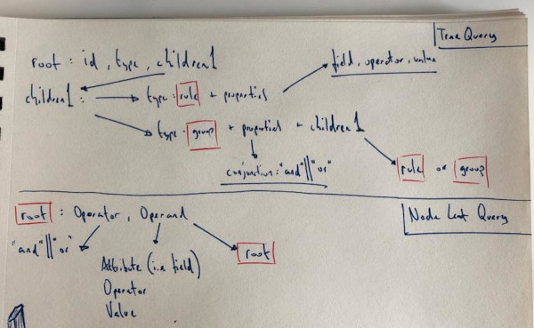

## query-builder

- ~~create wrapper component for react awesome query builder~~
- ~~create test harness to demo~~
- ~~host on netlify~~ (https://query-builder-2021.netlify.app/)
- ~~make trivial styling change~~
- ~~create diagram for comparing Tree Query (lib) vs Node Leaf Query~~
- ~~tests w/ Jest for library functions~~
- ~~demo various outputs~~
- ~~library: function to convert Tree Query into Node Leaf Query and vice versa~~
- ~~library: function to convert Meta in Fields and vice versa~~
- ~~remove excess operators from library, leaving only text, multiselect and number~~
- ~~include custom component~~
- ~~create dummy API call to retrieve multiselect values (example API call pending)~~
- ~~emplyed monumental hack to pre select multiselect fields~~
- _nice to have_: library: Node Leaf Query into Tree Query: use recursion to remove 5 nesting limit

**Diagram: Tree Query vs Node Leaf**

